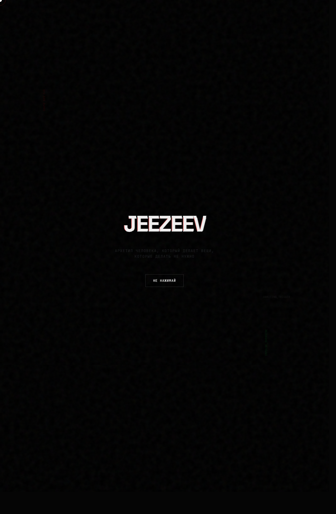
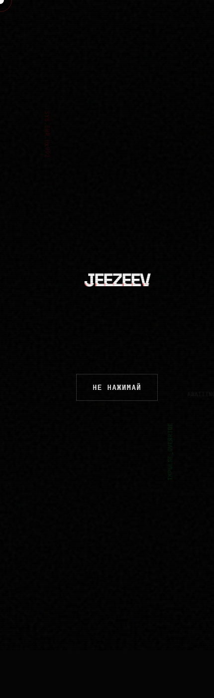

# Jeezeev

Промо-сайт в формате экспериментального реактивного лонгрида про архетип "JEEZEEV". Проект собран на `React + TypeScript + Vite`, использует `framer-motion` и акцентируется на глитч-эстетике, типографике и кинематографичных переходах.

## Preview





## Stack

- React 19
- TypeScript
- Vite
- Framer Motion

## Local Run

```bash
npm install
npm run dev
```

## Production Build

```bash
npm run build
```
